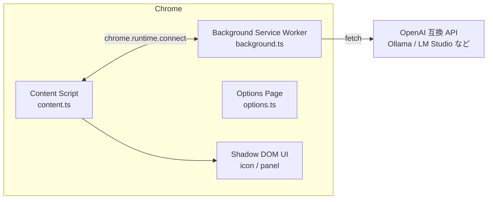

# tora 設計書

## 1. 概要

`tora` は、OpenAI 互換 API（Ollama など）と TranslateGemma モデルを利用した Chrome 拡張機能です。Web ページ上で選択したテキストを翻訳し、フローティングパネルにストリーミング表示します。

本ドキュメントでは、コードからは読み取りにくい設計方針と重要な判断の根拠を記録します。実装の細かい動作や算法については [docs/development.md](docs/development.md) を参照してください。

## 2. 設計原則

### 2.1 外部フレームワーク依存ゼロ

UI も状態管理もバニラ TypeScript で構築しています。Chrome 拡張機能は長期間動作し、依存の更新や互換性の問題による破損を最小化したいため、必要最小限の devDependency で運用します。

### 2.2 ホストページからの完全な分離

翻訳 UI は Content Script 内で closed Shadow DOM として描画します。これにより、ホストページの CSS や JavaScript からの干渉を防ぎ、また tora のスタイルがホストページに漏れることもありません。

### 2.3 ローカル LLM ファースト

すべての翻訳処理はローカル環境で動作する OpenAI 互換 API を想定しています。個人利用を前提としており、外部サービスへの通信は発生しません。

### 2.4 最小限の権限

動的なスクリプト注入を行わないため `activeTab` や `scripting` は不要とし、必要な権限のみを要求します。

## 3. アーキテクチャ概要

### 3.1 各コンポーネントの役割

| コンポーネント            | 責務                                                                       |
| ------------------------- | -------------------------------------------------------------------------- |
| Content Script            | ページ上の選択検知、アイコン/パネルの描画、ユーザー操作の受付              |
| Background Service Worker | OpenAI 互換 API へのリクエスト、SSE ストリームの解析、コンテキストメニュー |
| Options Page              | 設定 UI の提供、設定の読み書き                                             |

## 4. モジュール構成と責務

`src/` は関心事ごとに分割しています。

| ファイル         | 責務                                                                 |
| ---------------- | -------------------------------------------------------------------- |
| `content.ts`     | Content Script のエントリポイント。イベントリスナーの登録と初期化    |
| `events.ts`      | DOM イベント（選択・スクロール・リサイズ・ポインタ・キー）のハンドラ |
| `selection.ts`   | 選択の有効性判定、言語検出、選択状態の更新                           |
| `positioning.ts` | アイコン・パネルの位置計算、ビューポート収まり判定                   |
| `translate.ts`   | 翻訳開始・中断、Port メッセージ処理、パネル内容の更新                |
| `ui.ts`          | Shadow DOM 内のアイコン・パネル要素の生成と操作                      |
| `state.ts`       | Content Script 内の共有状態（module-level mutable state）            |
| `settings.ts`    | `chrome.storage.local` 経由の設定読み書き                            |
| `constants.ts`   | 言語リスト、デフォルト設定、言語名マッピング                         |
| `types.ts`       | 型定義                                                               |
| `ui-styles.ts`   | Shadow DOM 内のスタイル文字列                                        |

## 5. 主要な設計判断

### 5.1 Shadow DOM を closed にする

Shadow DOM を `closed` モードにしています。これにより、ホストページ側から `shadowRoot` へアクセスできず、UI の構造やイベントを保護できます。開発者ツールでのデバッグは依然可能です。

### 5.2 状態管理を module-level mutable state + setter で行う

Content Script は各タブで 1 インスタンスしか動作しないため、Redux などの状態管理ライブラリは導入しません。`state.ts` に mutable な変数を置き、setter 関数を通じて変更することで、状態変更の入口を限定しています。

### 5.3 TypeScript ソースは ES Modules、ビルド出力は IIFE

ソースコードでは `import`/`export` を使ってモジュール分割しますが、ビルド時には `esbuild` で IIFE 形式にバンドルします。これにより、Content Script / Background / Options それぞれが独立した単一ファイルとして Chrome 拡張に読み込まれます。

### 5.4 TranslateGemma 対応でクライアント側でプロンプトを完成させる

TranslateGemma の公式チャットテンプレートは `source_lang_code` などの特殊な変数を要求しますが、LM Studio などの多くのサーバーはこれを解釈できません。Ollama の Modelfile と同様に、クライアント側で翻訳用プロンプトを完成させて `content` として送信することで、サーバー側のテンプレートに依存しないようにしています。

詳細は [docs/translategemma-compatibility.md](docs/translategemma-compatibility.md) を参照してください。

### 5.5 自動翻訳を行わない

テキストを選択しただけでは翻訳を開始せず、ユーザーがアイコンをクリックしてから翻訳します。これにより、誤った選択や不要な API 呼び出しを防ぎます。

### 5.6 言語自動検出の信頼性判定を厳しくする

`chrome.i18n.detectLanguage()` は `isReliable === true` の場合のみ採用し、不確かな場合は `Unknown (unknown)` として翻訳を継続します。精度が必要な場合はユーザーに手動設定を促す方針です。

### 5.7 `zh` を `zh-Hans` として送信

TranslateGemma のプロンプトでは中国語を `zh-Hans` として扱う方針を採用しています。

### 5.8 翻訳履歴・コピー機能・接続テストボタンを置かない

MVP では最小限の機能に絞っています。これらは必要に応じて将来追加する検討事項です。

### 5.9 設定を自動保存にする

オプション画面の入力変更時に即座に保存します。保存ボタンは不要とし、ユーザーが即座に反映される体験を提供します。

## 6. UI/UX 設計

### 6.1 選択検知

- `selectionchange` で既存 UI を即座に隠す
- `pointerup` / `keyup` で選択の有効性を判定しアイコン表示
- 2 文字未満、空白のみ、`<input>` / `<textarea>` / `contenteditable` / `<iframe>` / Shadow DOM 内の選択は無視

### 6.2 アイコンとパネル

- アイコンは選択範囲の近くに表示
- パネルはアイコンを基準に、ビューポート内に収まる方向へ開く
- 手動でドラッグ・リサイズすると、以降は自動配置を停止

詳細な配置算法は [docs/development.md](docs/development.md) を参照してください。

### 6.3 カラーテーマ

Shadow DOM 内の UI は `prefers-color-scheme` に対応し、ダーク/ライトモードを自動切り替えします。

## 7. セキュリティとプライバシー

- API キーは `options.html` 上で `type="password"` 入力とし、`chrome.storage.local` に保存
- Content Script は `matches: ["<all_urls>"]` で注入されるが、ページのデータを外部に送信しない
- 翻訳履歴は保存しない

## 8. 権限

| 権限                                         | 用途                                        |
| -------------------------------------------- | ------------------------------------------- |
| `storage`                                    | 設定の保存                                  |
| `contextMenus`                               | 右クリックメニュー                          |
| `host_permissions: <all_urls>`               | すべての Web ページで Content Script を実行 |
| `host_permissions: http://localhost:11434/*` | ローカル API サーバーへの通信               |

## 9. ビルドと配布

- `package.json` の `version` を信頼情報源とし、ビルド時に `manifest.json` の `version` を同期
- 配布は GitHub Releases の ZIP のみ行い、Chrome Web Store には公開しない

## 10. 今後の検討事項

- ブラウザ組み込み翻訳 API（Chrome Translator API / Prompt API など）の実装
- アクセシビリティ向上（`Esc` 以外のキーボードショートカット）
- 翻訳履歴・コピー機能
- 言語リストの拡張・カスタマイズ
